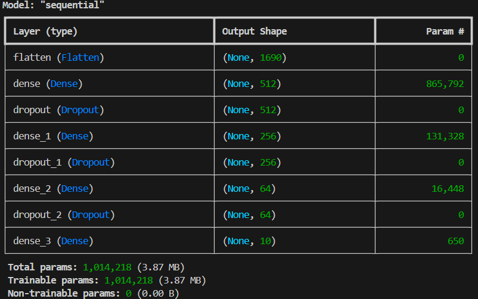
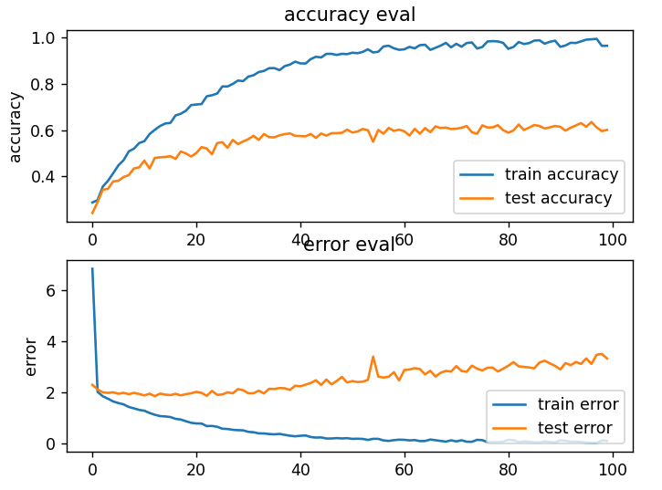

# 🎵 Music Genre Classification (Deep Learning)

A deep learning project for classifying music genres using audio features and neural networks.  
This repository is part of my learning journey in Deep Learning for audio processing using Python and TensorFlow.

The project focuses on extracting MFCC features from audio files and training a CNN model to recognize different music genres.

---

## 📍 Background & Motivation

This project was created as part of my learning process in Deep Learning, especially in audio data processing.

I followed and learned from this YouTube playlist:

📺 [Valerio Velardo - The Sound of AI](https://youtube.com/playlist?list=PL-wATfeyAMNrtbkCNsLcpoAyBBRJZVlnf)

The dataset used in this project is the [**GTZAN Music Genre Dataset**](https://www.kaggle.com/datasets/andradaolteanu/gtzan-dataset-music-genre-classification), available on **Kaggle** and commonly used in music genre classification research.

Through this project, I explore how neural networks can understand sound patterns and classify music into different genres. My main goal is to gain hands-on experience with audio feature extraction, model training, and evaluation.

---

## ✨ Technologies

- `Python`
- `TensorFlow`
- `Keras`
- `Librosa`
- `NumPy`
- `Matplotlib`
- `Scikit-learn`

---

## 🚀 Features

- Extracts MFCC features from audio files
- Preprocesses dataset into JSON format
- Trains a CNN-based deep learning model
- Evaluates model performance
- Predicts music genres from audio input
- Visualizes training history (accuracy & loss)

---

## 📁 Project Structure

Here are the main files in this repository and their purposes:

| File Name | Description |
|-----------|-------------|
| `prepare_dataset.py` | Extracts MFCC features from audio files and saves them into a JSON file |
| `data.json` | Contains extracted MFCC features and labels |
| `genre_classification.py` | Trains the deep learning model |
| `cnn_genre_classification.py` | CNN-based model implementation |

> Note: File names may vary depending on project updates.

---


## 🧠 What I Learned

This project is divided into several learning stages, starting from basic audio processing to building deep learning models for classification.

### 1️⃣ Audio Preprocessing
I started by learning how audio data can be transformed into numerical features that can be understood by machine learning models. One of the most important features I explored was **MFCC (Mel-Frequency Cepstral Coefficients)**.

In this step, WAV audio files were converted into MFCC features and stored in `data.json` for further training and evaluation.

---

### 2️⃣ Genre Classification using MLP (Multi-Layer Perceptron)

After preparing the dataset, I built my first genre classification model using a Multi-Layer Perceptron (MLP) based on the extracted audio features. This model served as my initial baseline for genre classification.

<figure align="center">
<p align="center">
  <a href="image/architectur-model-MLP.png">
    
  </a>
</p>
<p align="center">
  <i>  
    MLP Model Architecture
  </i>
</p>
  
During training, the model showed signs of overfitting, with training accuracy reaching around 0.9 while testing accuracy stayed low at about 0.4. To address this issue, I introduced dropout layers and L2 regularization to improve generalization. As a result, the model became more stable and achieved a final accuracy of approximately **0.6**.

📸 Model Performance Comparison

<figure align="center">
<p align="center">
  <a href="image/MLP-base.png">
    
  </a>
  &nbsp;&nbsp;&nbsp;&nbsp;&nbsp;
  <a href="image/MLP-with L2 and Dropout.png">
    
  </a>
</p>
  
<p align="center">
  <i>
    (Left) Overfitted model without regularization. 
    (Right) Regularized model with L2 and Dropout.
  </i>
</p>
</figure>

---

### 3️⃣ Genre Classification using CNN (Convolutional Neural Network)

Next, I explored Convolutional Neural Networks (CNN) to build a more powerful model for audio classification. Compared to MLP, CNN can better capture important patterns from MFCC features, making the model more effective in learning audio representations.

At this stage, I learned how convolution and pooling layers help extract useful features and improve model performance. I also understood the importance of preparing input data properly before feeding it into the network, including reshaping it into 4D tensors:

```python
X_train[..., np.newaxis]  # 4D array -> (num_samples, num_frames, num_mfcc, depth)
```
Overall, this step helped me gain a deeper understanding of how CNNs work for audio classification tasks.

